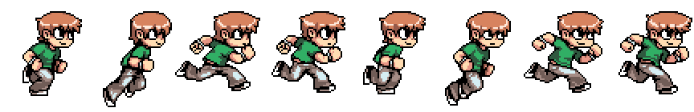

# Sudoku Game - JQUERY - [DEMO](https://arnedo5.github.io/SudokuGame/)

**Introduccion**

Sudoku credo a partir de HTML, CSS, JQUERY y otro plugins. El proyecto esta fragmentado en diferentes archivos js para su mejor mantenimiento y gestion del mismo.

**Lista de incorporaciones**

- [x] Multiples imagenes para escoger.
- [x] Multiples estilos de fondos, más estilos de botones.
- [x] Multiples lenguajes | CAT | ES | ENG | PT.
- [x] Multiples musicas para escojer, más control de volumen i música en general.
- [x] Multiples niveles de dificultad para escoger.
- [x] Adaptativo para móbil

**Futuras funcionalidades**

- [ ] Mas idiomas para seleccionar
- [ ] Puntuación por nivel, más puntuacion por usuario.
- [ ] Registro de usuarios.

## Contenido

- [Arbol de carpetas](#carpetas)
- [Funcionalidades](#contenido)
- [Menu de configuraciones](#configuracion)
- [Sobre el creador](#creador)

### Arbol de carpetas

* audio
  * gameMusic
  * transition
* config
* css
* img
  * background
  * colors
  * configIMG
  * configLAN
  * configLevel
  * configMusic
  * fruits
  * jungle
  * music
  * sprites
  * titles
* js

## Menu de configuraciones

**Imagenes**

** Idioma**

**Musica** 

### Sobre el creador

